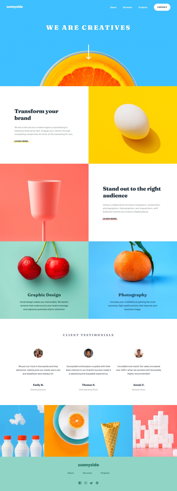
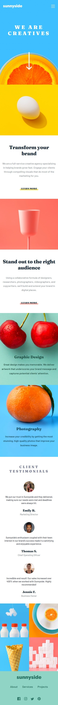

# Frontend Mentor - Sunnyside agency landing page solution

Esta é uma solução para o [Sunnyside agency landing page challenge on Frontend Mentor](https://www.frontendmentor.io/challenges/sunnyside-agency-landing-page-7yVs3B6ef). Os desafios do Frontend Mentor ajudam você a melhorar suas habilidades de codificação ao construir projetos realistas.

## Índice

- [Visão geral](#visão-geral)
  - [O desafio](#o-desafio)
  - [Captura de tela](#captura-de-tela)
  - [Links](#links)
- [Meu processo](#meu-processo)
  - [Construído com](#construído-com)
- [Autor](#autor)

## Visão geral

### O desafio

Os usuários devem ser capazes de:

- Visualizar o layout ideal para o site, dependendo do tamanho da tela do dispositivo
- Veja os estados de foco para todos os elementos interativos na página

### Captura de tela

### Links

- URL do site ativo: [Link](https://julioalves-dev.github.io/sunnyside-agency-landing-page-main/)

## Meu processo

### Construído com

- HTML5
- CSS3
- Flexbox
- CSS Grid
- JavaScript

## Autor

- Frontend Mentor - [@JulioAlves-Dev](https://www.frontendmentor.io/profile/JulioAlves-Dev)
- Twitter - [@JulioAlv35](https://twitter.com/JulioAlv35)
- Linkedin - [Julio Alves](https://www.linkedin.com/in/julio-alves-0119b01a6/)
